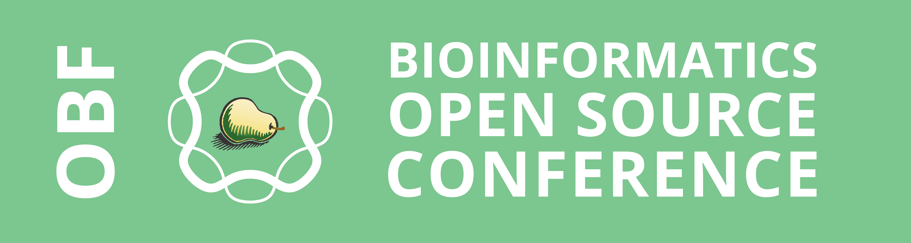
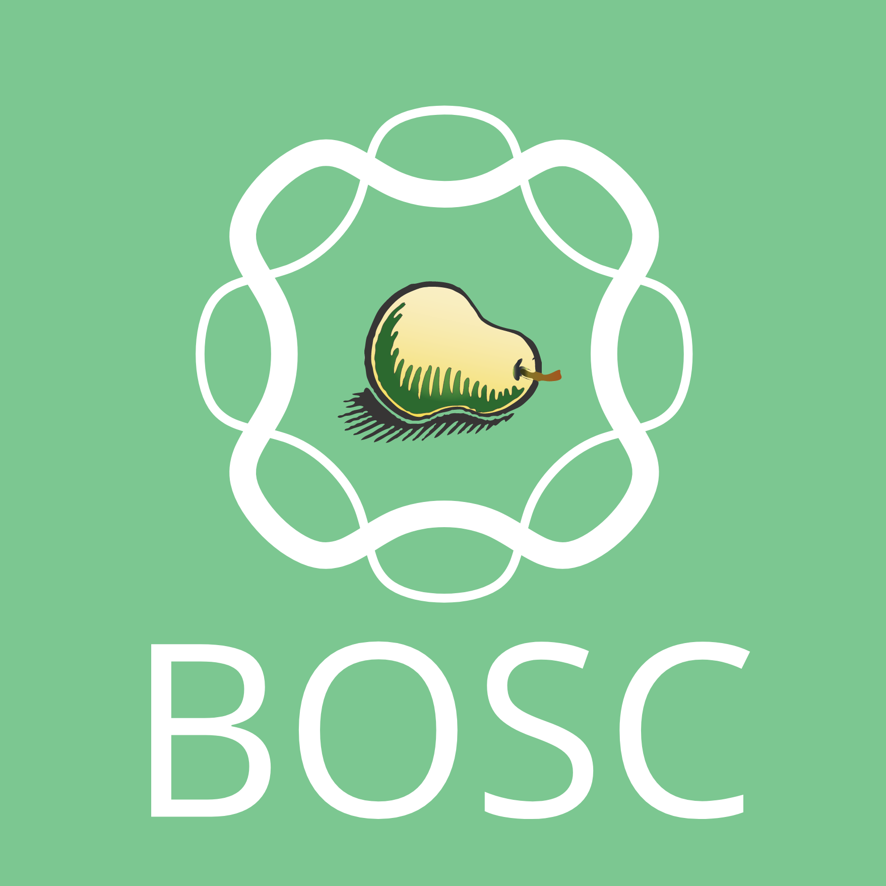
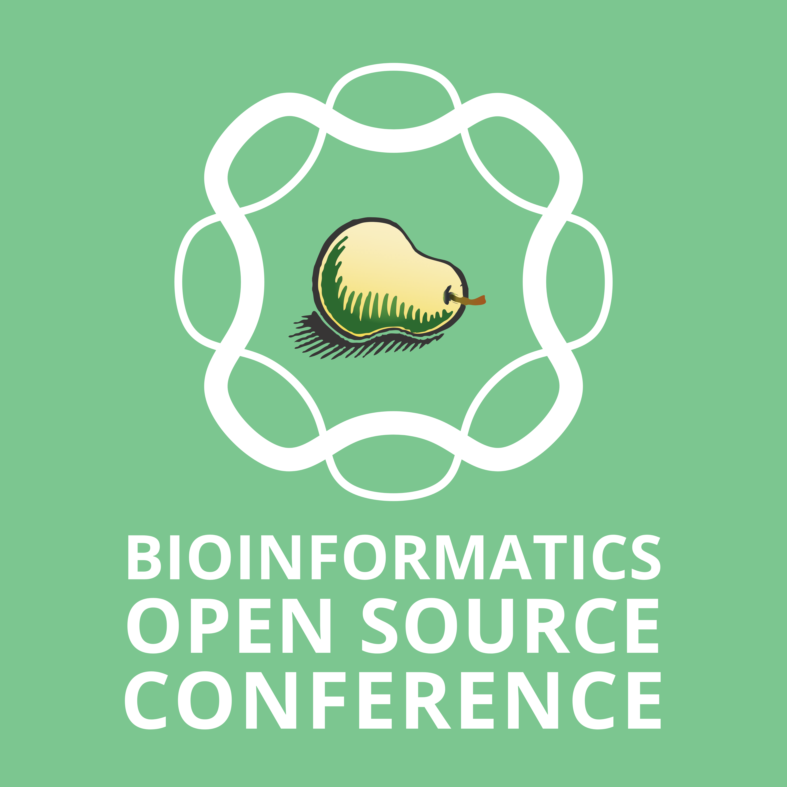
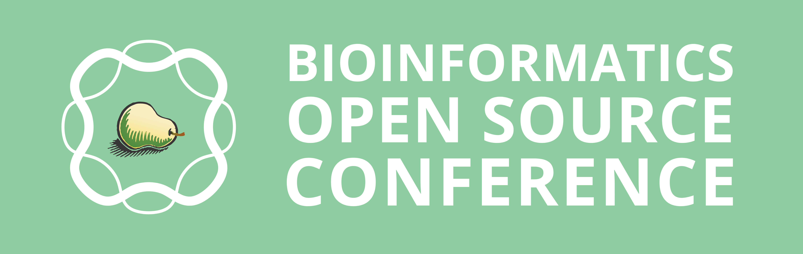

## Notes 

- Font used in all logos: Open Sans
- .gvdesign file extension opens in [Gravit Designer](https://www.designer.io/), a free vector editor. 

## Image previews

obf-bosc-banner

-----

obf-bioinformatics-open-source-conference-banner

-----

bosc-plus-new-obf-square

-----

bosc-banner

-----

bioinformatics-open-source-conference-square

-----

bioinformatics-open-source-conference-banner

-----

bosc-pear-square-white

-----

bosc-pear-square-green

----

bosc-pear-transparent-square

----

bosc-pear-transparent

